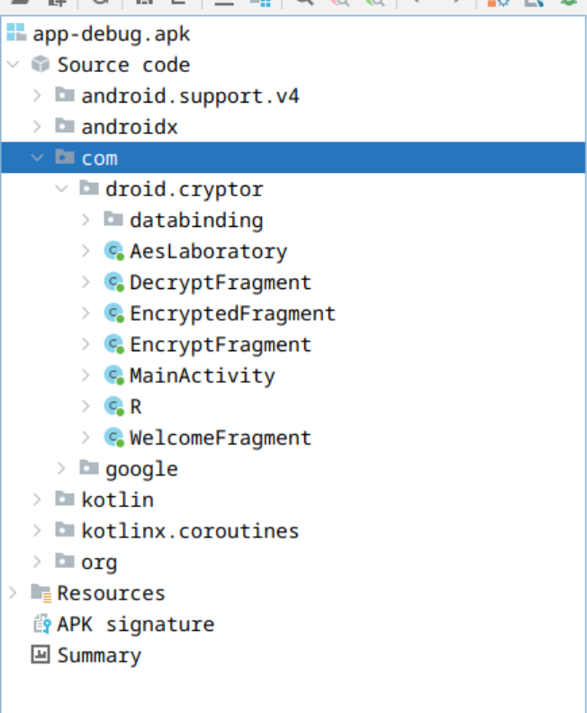
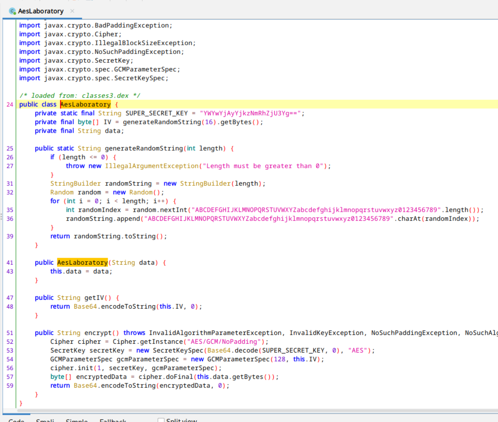

# DroidCryptor
<b>Author</b>: Daniele [dadadani.xyz](https://dadadani.xyz)<br>
<b>Category</b>: Reverse<br>
<b>Solves</b>: 25<br>

## Description

One of my friends told me about this application that promised to keep your data safe. When I tried to encrypt the data, I found out later that there is no way to view it! Can you retrieve my message?

## Solution

This application allows us to "encrypt" messages, while the "decrypt" section is unavailable.

To find out more about how the code works, we need to decompile the application: An utility that helps us is [jadx](https://github.com/skylot/jadx).



By opening the apk file into jadx, we can see that there are multiple classes that are part of `com.droid.cryptor`. Interestingly, there is also a class called `AesLaboratory`.



By opening the suspected file, we can see that the code does exactly what we want:
- The key is static, and decoded from base64
- The IV is randomly generated when the class is initialised
- The encryption algorithm is AES GCM 128 Bits

Given this information, we can create our own function that performs the decryption operation:

```python
from cryptography.hazmat.primitives.ciphers.aead import AESGCM
import base64

def decrypt_aes_gcm(key_b64: str, iv_b64: str, message_b64: str) -> str:
    try:
        # Decode base64 inputs
        key = base64.b64decode(key_b64)
        iv = base64.b64decode(iv_b64)
        ciphertext = base64.b64decode(message_b64)
        
        # Create AESGCM cipher
        cipher = AESGCM(key)
        
        # Decrypt the message
        plaintext = cipher.decrypt(iv, ciphertext, None)
        
        # Return decoded plaintext
        return plaintext.decode('utf-8')
    
    except Exception as e:
        raise Exception(f"Decryption failed: {str(e)}")
    
print(decrypt_aes_gcm("YWYwYjAyYjkzNmRhZjU3Yg==", "TXdESVBYeWc1dldkbHNFaQ==", "XZdGZ7pi9Ih4wHL/8Mj0q8/o6i/utS2tIsigHXCaEzpTXgesqtnLNJMbagqYH67ut9dbxhXC28w="))
```

```bash
$ python decrypt.py 
ptm{flag}
```