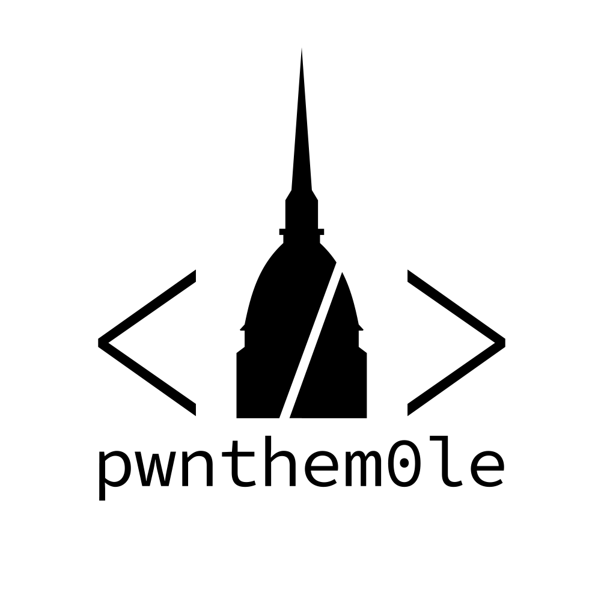

    

# m0leCon beginner CTF 2024

m0leCon Beginner CTF 2024 was the fourth edition of the beginner-friendly capture the flag competition organized by [Politecnico di Torino](https://www.polito.it/)'s cybersecurity student team [pwnthem0le](https://pwnthem0le.polito.it/). Mainly aimed towards Politecnico di Torino's students, the competion was open to everyone to join and was held online on 14th December 2024. The  competition lasted 5 hours, from 13:00 to 18:00 (UTC)

## Challenges

| Challenge | Category | Author |
| --------- | -------- | ------ |
| [susculator](/susculator) | Reverse | lostGino04 |
| [DroidCryptor](/DroidCryptor) | Reverse | Daniele [dadadani.xyz](https://dadadani.xyz) |
| [Magical Advisor](/Magical%20Advisor) | Reverse | lorenzobunaj |
| [GoRevIt](/GoRevIt) | Reverse, Misc | [Schrödy](https://github.com/AndreaGordanelli) |
| [pickle soup](/pickle%20soup) | Misc | [x55xaa](https://discordapp.com/users/916317034327969822) |
| [Strange noise](/Strange%20noise) | Misc | [ImNotFanta](https://github.com/ImNotFanta/) |
| [A car hacker's first steps](/Car%20hacker) | Misc | [Pixel](https://github.com/Pix3l01) |
| [Small RSA](/Small%20RSA) | Crypto | [kyooz](https://bsky.app/profile/blahajpilled.bsky.social) |
| [datadestroyer9000](/datadestroyer9000) | Crypto | [kyooz](https://bsky.app/profile/blahajpilled.bsky.social) |
| [Identity Theft](/Identity%20Theft) | Crypto | [Mrdega](https://discordapp.com/users/684707774831001600) |
| [Locked Door](/Locked%20Door) | Web, Crypto | [meni](https://github.com/menitz/) |
| [GoSecureIt](/GoSecureIt) | Web | [Schrödy](https://github.com/AndreaGordanelli) |
| [CookieShop](/CookieShop) | Web | [meni](https://github.com/menitz/) |
| [ImgPlace](/ImgPlace) | Web | Daniele [dadadani.xyz](https://dadadani.xyz) |
| [KIRBY'S FLAG](/kirby) | Misc | lostGino04 |
| [XORed picture](/XORed%20picture) | Misc, Crypto | Vic |
| [PIETcture](/PIETcture) | Misc | [TagBot](https://discordapp.com/users/596275829215068191) |
| [Small Auth](/Small%20Auth) | Crypto | Rising |
| [Hypwn](/Hypwn) | Pwn | MrCarr & Dione |

## What's in this repo?

In every folder, you will find a README file containing various infos about the challenges (author, category, solves during the CTF, description, and a small write-up). 
If the challenge had downloadable attachment(s) you will find them in the `dist` folder, otherwise, the folder will not be present. 
If the challenge was generated through unreleased source code or had a backend server you will find a `src` folder containing them, otherwise, the folder will not be present. In the case of a backend server, the README of the challenge will also have instructions to run it.

    

